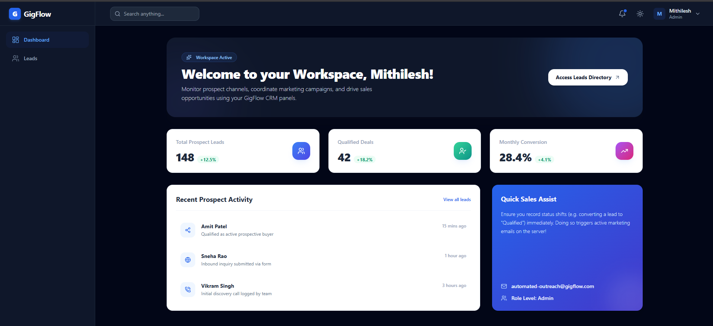
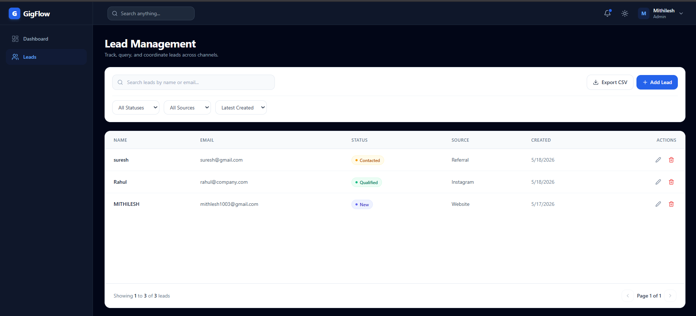
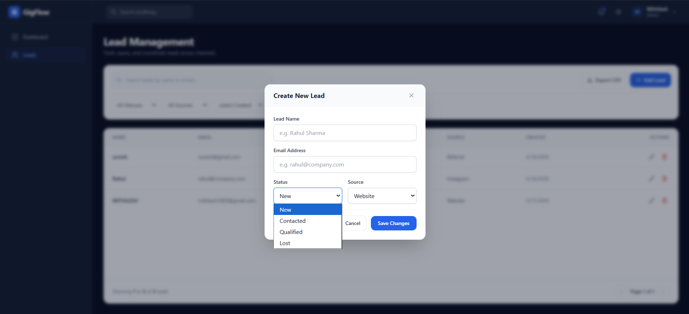
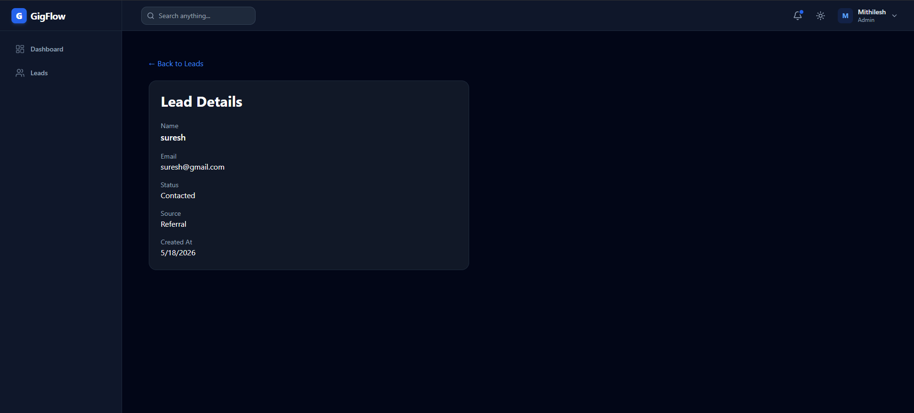

# ⚡ GigFlow


> **GigFlow** is a modern, enterprise-ready MERN stack application tailored for efficient Lead Management. It features strict TypeScript typings, comprehensive Role-Based Access Control (RBAC), and a beautifully crafted, highly-responsive frontend command center.

---

## 📖 Project Overview

GigFlow equips sales teams and administrators with a high-performance workspace to track, query, and coordinate leads across various channels (Website, Instagram, Referrals). Built with scale in mind, it seamlessly integrates advanced data-grid functionalities—such as debounced searching, server-side pagination, status filtering, and dynamic CSV data exports—all wrapped in a premium Dark/Light mode UI.

## ✨ Features

- **Robust Authentication:** Secure JWT-based session management and encrypted passwords.
- **Role-Based Access Control (RBAC):** Distinct permissions separating `Admin` and `Sales` users. Sales roles can interact with leads but are strictly blocked from destructive operations (like deleting records).
- **Advanced Lead Management:** Create, view, edit, and delete prospects safely.
- **Server-Side Data Operations:** Scalable queries incorporating skip/limit pagination, chronological sorting, and regex-powered global searching.
- **One-Click CSV Export:** Instantly extract active, filtered lead queries into formatted CSV files.
- **Premium User Experience:** Immersive UI using glassmorphism, smooth micro-animations, skeleton loaders, and graceful empty/error states.
- **Dynamic Dark Mode:** Class-based Light/Dark theme toggle with automatic persistence via `localStorage`.
- **Form Integrity:** Rock-solid input validation via `Zod` schemas intersecting both the frontend (`react-hook-form`) and the Express routing layer.
- **Containerized:** Fully Dockerized architecture utilizing Nginx reverse proxies and lightweight Alpine builds.

---

## 🛠 Tech Stack

### Frontend (Client)
- **Framework:** React 18 + Vite
- **Language:** TypeScript
- **State Management:** Zustand (Auth/Theme), TanStack Query (Server State)
- **Styling:** Tailwind CSS (v3) + `lucide-react` icons
- **Form & Validation:** React Hook Form + Zod

### Backend (Server)
- **Runtime:** Node.js
- **Framework:** Express.js
- **Language:** TypeScript
- **Database:** MongoDB + Mongoose ODM
- **Security:** Helmet, CORS, bcryptjs, JSONWebToken (JWT)

---

## 📂 Folder Structure

```text
gigflow/
├── client/                 # Frontend React Application
│   ├── public/             # Static assets
│   ├── src/
│   │   ├── api/            # Axios API client setup
│   │   ├── components/     # Reusable UI components (Tables, Modals, Inputs)
│   │   ├── hooks/          # TanStack Queries and Custom Permissions
│   │   ├── layouts/        # Dashboard wrappers and navigation
│   │   ├── pages/          # Main route components (Login, Leads, Dashboard)
│   │   ├── store/          # Zustand global stores (auth, theme)
│   │   └── types/          # Strict TypeScript interface definitions
│   ├── Dockerfile          # Multi-stage Vite -> Nginx build
│   └── tailwind.config.ts  # Design system tokens and Dark Mode config
│
├── server/                 # Backend Node.js API
│   ├── src/
│   │   ├── controllers/    # Route handlers
│   │   ├── middlewares/    # Auth, Error handlers, Async Wrappers
│   │   ├── models/         # Mongoose DB Schemas
│   │   ├── routes/         # Express API routing logic
│   │   ├── services/       # Core business logic and query builders
│   │   └── index.ts        # Server entry point
│   └── Dockerfile          # Multi-stage production build
│
└── docker-compose.yml      # Orchestration for Frontend, Backend, and MongoDB
```

---

## ⚙️ Environment Setup

### Backend (`server/.env`)
```env
PORT=5000
MONGO_URI=mongodb://localhost:27017/gigflow
JWT_SECRET=your_super_secret_jwt_key
JWT_EXPIRES_IN=7d
NODE_ENV=development
```

### Frontend (`client/.env`)
```env
VITE_API_URL=http://localhost:5000/api/v1
```

---

## 🚀 Installation Steps (Local Development)

**1. Clone the repository**
```bash
git clone https://github.com/Mithilesh-93919/gigflow.git
cd gigflow
```

**2. Setup the Backend**
```bash
cd server
npm install
# Ensure MongoDB is running locally on port 27017
npm run dev
```

**3. Setup the Frontend**
```bash
cd ../client
npm install
npm run dev
```
The client will start dynamically (typically on `http://localhost:5173`).

---

## 🐳 Docker Setup (Production Ready)

GigFlow includes a highly-optimized, multi-stage Docker environment mimicking production deployments.

1. Ensure Docker and Docker Compose are installed on your machine.
2. At the root of the project, run:
```bash
docker-compose up --build -d
```
3. The application is now accessible!
   - **Frontend UI:** `http://localhost:80`
   - **Backend API:** internally proxied and natively accessible on port `5000` (or via `/api/v1` on the frontend host).

> **Note:** The frontend utilizes Nginx as a reverse proxy, cleanly handling React Router fallback mapping and secure API proxying to avoid CORS constraints in production.

---

## 🔗 API Routes

| Method   | Endpoint                  | Access        | Description                               |
| :------- | :------------------------ | :------------ | :---------------------------------------- |
| `POST`   | `/api/v1/auth/register`   | Public        | Register a new user                       |
| `POST`   | `/api/v1/auth/login`      | Public        | Authenticate and receive JWT token        |
| `GET`    | `/api/v1/auth/me`         | Private       | Fetch current user profile                |
| `POST`   | `/api/v1/leads`           | Admin/Sales   | Create a new lead                         |
| `GET`    | `/api/v1/leads`           | Admin/Sales   | Get paginated, filtered leads             |
| `GET`    | `/api/v1/leads/export`    | Admin/Sales   | Download filtered queries as a CSV file   |
| `GET`    | `/api/v1/leads/:id`       | Admin/Sales   | Retrieve a single lead by ID              |
| `PUT`    | `/api/v1/leads/:id`       | Admin/Sales   | Update an existing lead                   |
| `DELETE` | `/api/v1/leads/:id`       | **Admin Only**| Permanently delete a lead                 |

---

## 📸 Screenshots

*(Replace placeholder links with actual hosted image assets)*

| Dashboard Overview | Leads Directory Grid |
| :---: | :---: |
|  |  |

| Add Lead Modal | Lead Details |
| :---: | :---: |
|  |  |


## 🔮 Future Improvements

- [ ] **Analytics Engine:** Visual charts detailing lead conversion rates and channel effectiveness over time.
- [ ] **Email Integration:** Automated welcome and follow-up emails triggered by Lead Status changes.
- [ ] **WebSocket Notifications:** Real-time push notifications when other team members update prospects.
- [ ] **Activity Logs:** Auditing trail for lead updates (e.g., tracking who transitioned a lead to "Qualified" and when).

---

*Engineered with precision for scale.* 🚀
